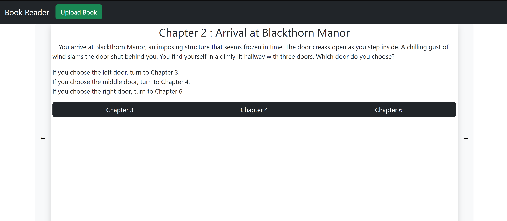

# About
An interactive book app that allows the reader to choose their own story. Most of the logic is related to using the TurnJs library to display the parsed text from a book. The only supported file format is a text file (.txt). See the special notes section for the book content format within the the file.

Project can be viewed in GithubPages page:
[Live Demo](https://chrisblanks.github.io/flipbook/)

# Building
To setup project after cloning, run `npm install` in the top level directory.

Execute `npm run build` to package source code into a bundle via webpack. Build artifacts
will appear in the `dist/` directory.

Use `npm run server` or `npx vite` to run server. Should be able to see build artifacts if `dist/` directory is added to url.
use `npx vite build` to build prod version and run in server

# Special Notes
The book text must be in the following format:

